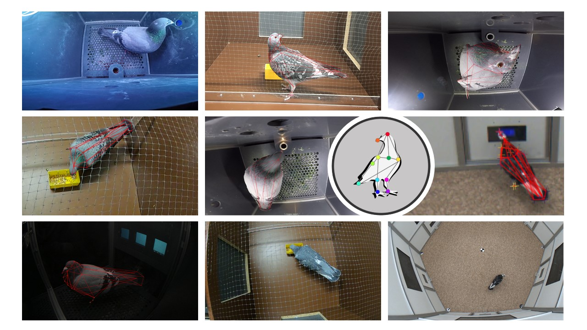

# Welcome

The PigeonSuperModel is an open source dataset with multiple pre-trained deep-learning models for markerless pose tracking in pigeons. We provide multiple pre-trained network architectures such as MobileNet, ResNet and EfficientNet to be used in [DeepLabCut](https://deeplabcut.github.io/DeepLabCut), as well as the manually labeled dataset with 3019 labeled frames to train and evaluate further models for pigeon tracking.

We originally started this project for 2D markerless pose tracking and multi-view camera triangulation for 3D reconstruction using [Anipose](https://anipose.readthedocs.io/en/latest/index.html). But the underlying datset is openly available and can be used for further machine learning projects.

## Why a PigeonSuperModel?

Advances in computational neuroethology and markerless pose estimation are making it ever easier for researchers to quantify animal behavior from non-invasive video recordings. Yet, these models still rely on specialized hardware (particularly GPUs), and the underlying data for model training is usually hard to get.

With this PigeonSuperModel we provide multiple pre-trained neural networks for out-of-the-box video analysis of pigeon behavior. We also make the underlying dataset openly available with over 3000 manually labeled images of single pigeons in different settings, recorded from multiple camera views. We specifically trained these models to generalize well across different experimental setups, using different cameras and different animals. Nonetheless, we found that these pre-trained models can be easily re-trained on outlier frames to specialize on any particular setup, if needed.

## Dataset

### Overview

The dataset we provide consists of over 3000 manually labeled frames of single pigeons from 5 different experimental setups, recorded from multiple views in different lighting conditions. The purpose of this dataset is to provide a resource for researchers working on markerless pose tracking in pigeons, and to enable the development of more accurate and efficient models for this task.

### Data Augmentation

To increase out-of-the-box tracking performance in new recordings with different video resolutions and lighting conditions, we augmented the dataset to introduce common image distortions such as blur, compression, and re-scaling artifacts. We provide the code to manually augment the dataset, as well as the final 21k augmented dataset used for model training.

## Models

We trained multiple DeepLabCut models based on different architectures (`mobilenet`, `resnet`, `efficientnet`) and compared tracking performance and inference time between models. We make all pre-trained models available for out-of-the-box analysis of new videos.

## Tutorial

To wrap it all up, we provide some further instructions on how to make use of our pre-trained models, including a section on how to re-train these models to your specific experimental setup. We also guide you through the entire process in DeepLabCut with beginner friendly jupyter notebooks.

## Contributors

This project was carried out by Guillermo Hidalgo Gadea and Sarah C. Möser at the department of Biopsychology with the Institute of Cognitive Neuroscience at the Ruhr-University Bochum. Data collection from multiple ongoing experiments was a team effort from the entire [Biopsychology Team](https://www.bio.psy.ruhr-uni-bochum.de/members.html). 

## Open Source License

This is an open source project under the [MIT license](LICENSE) and we actively encourage its use as a resource in science. Please get in touch, we will be happy to help you out setting up your own project and to hear about your research.

## Funding

This work was carried out at the Institute of Cognitive Neuroscience (IKN), Department of Biopsychology, at the Ruhr-University Bochum and supported by the Deutsche Forschungsgemeinschaft DFG (German Research Foundation) through SFB 1372 project number 395940726, subproject Neu06, as well as in the context of funding the Research Training Group “Situated Cognition” (GRK 2185/1).
